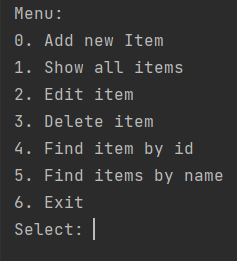
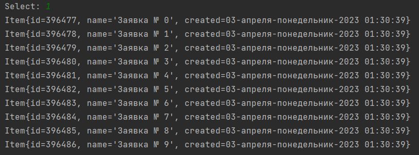
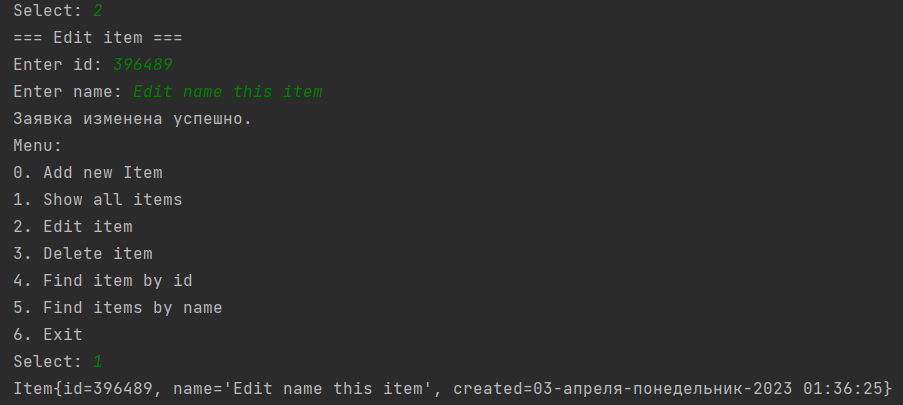

# Проект "Tracker"

* [Описание](#описание)
* [Функционал](#функционал)
* [Технологии](#технологии)
* [Интерфейс](#интерфейс)
* [Автор](#автор)

## Описание

Консольное приложение для работы с задачами.

## Функционал

* Добавление задачи;
* Редактирование задачи;
* Удаление задачи;
* Вывод всех текущих задач;
* Поиск по имени и id;
* Две модели хранения данных:
    - Хранение в оперативной памяти (реализация Store -> MemTracker);
    - Хранение в базе данных PostgreSQL:
      - Работа с базой через запросы JDBC (реализация Store -> SqlTracker);
      - Работа с базой через запросы HQL (реализация Store -> HbmTracker).

## Технологии

* Java 18;
* Hibernate 5;
* PostgreSQL;
* JDBC;
* Lombok;
* Log4j;
* Тесты: Junit5, Mockito. Работают c H2 db;
* Maven. Поддержка профилей test/prod;
* Liquibase.

## Интерфейс

* Интерфейс меню

  

* Вывод всех задач

  

* Редактирование задачи

  

## Автор

Michael Zalogin

zaloginmiha@gmail.com

+79111480757
